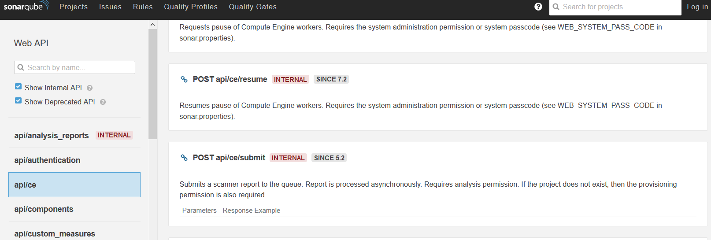

CVE-2020-28002
==============

[Current Desprition](https://nvd.nist.gov/vuln/detail/CVE-2020-28002)
In SonarQube 8.4.2.36762, an external attacker can achieve authentication bypass through SonarScanner. With an empty value for the -D sonar.login option, anonymous authentication is forced. This allows creating and overwriting public and private projects via the /api/ce/submit endpoint.
(It is already fixed.)

[Introduction to SonarQube](./../SonarQube/README.md)

### Who uses SonarQube
SonarQube is used and loved by 300,000+ organizations.
* Barclays
* IBM
* Microsoft
* Cisco
* ...

### What is the real-world impact
All these organization's code is in danger. From an attacker's perspective, products like SonarQube become attractive because they store or have access to all the source code of an organization's applications, thus it is more profitable to attack a link in the DevSecOps process than the application itself. All these orginazations are in danger and then all customers of these originizations are in danger.

### Common Weakness Enumeration (CWE) and Common Attack Pattern Enumeration and Classification (CAPEC)
CWE-287: Improper Authentication

When a participant states that he or she has a given identity, the software is unable or insufficient to prove that the identity is correct. In the incident we studied, an external attacker could bypass the authentication step through SonarScanner. A similar event is the authentication function of the OWASP ESAPI, where the login script bypasses authentication when the value of "login_ok" is 1.

Why does this happen? In some cases, the authentication error returns "nil" instead of "false", so some invalid usernames may use this to bypass authentication. Or the administrator does not select any authentication module, so the script does not handle the situation correctly and an error occurs.

A few characteristic CAPECs

* CAPEC-115: Authentication Bypass (Medium Severity) 

The attacker can access the protected data without authentication.

* CAPEC-151: Identity Spoofing (Medium Severity) 

The attacker could make messages that appear to be from a different principle or use spoofed authentication credentials.

* CAPEC-114: Authentication Abuse (Medium Severity)

The attacker use the weakpoint of the authentication and gains unauthorized access to an application, service or device.

* CAPEC-22: Exploiting Trust in Client (High Serverity)

An attacker performs this type of attack by communicating directly with the server, which believes it is only communicating with valid clients.

### Detailed Information
[Video Introduction](https://www.youtube.com/watch?v=wn9sQC3rYC8)

SonarQube ID information

* Server ID: 32FADB56-AXRx4wuyUe_xmLIBDkFu
* Version: 8.4.2.36762
* Date: 2020-10-22

When the SonarQube system is mounted for the first time , without prior authentication they will not be able to find any access to create a project or analyze it, they only have visibility over those that have been left publicly exposed ( so far, good ), however, this behavior does not it is fulfilled to the letter, since an external party can create anonymous projects and additionally overwrite existing projects, whether public or private, and best of all, without authentication.

In local or with any of the possible integrations, when we need to scan the project, we are asked to indicate at least the following parameters to SonarScanner :

* sonar.projectKey= Name of the project to analyze
* sonar.sources= Path where the code is located
* sonar.host.url= SonarQube server URL or by default call SonarCloud.io
* sonar.login= Username or connection token
* sonar.password= Required if used in conjunction with sonar.login

In the above, basic or token authentication is contemplated, and it is reasonable to think that without providing a correct token or an adequate login and password, it is not possible to carry out an analysis or upload information to the server:

For example: 
sonar-scanner.bat -D"sonar.projectKey=test" -D"sonar.sources=." -D"sonar.host.url=http://localhost:9000" -D"sonar.login=f82ed59434b9f827be05dccd0fa4e10db90d9649"

If we scan the project with an empty login without the password parameter in the current version(9.3), it looks like:

Indeed, the response tells us that we do NOT have authorization for the analysis or project creation actions. But in version 8.4.2.36762, it can bypass the authorization and have the following response.

sonar-scanner.bat -D” sonar.projectKey = anonymous_project ” -D” sonar.sources= . ” -D” sonar.host.url= http://192.168.0.56 ” -D” sonar.login= “

Validating the logs and internal tasks in SonarQube , it can be seen that the project previously created without authentication was assigned by the anonymous user :

The normal behaviour should be from the user you logged in, for example, if you login as admin

The next step is to check if it is possible to have the same behavior but with a private project , which, being private, is not listed or accessible by default, it requires privileges and an authenticated user:

* Name: private_project
* Visibility: private
* Creator: admin

In version 8.4.2.36762, if we indicate projectkey to "private_project" and leave the login empty like:

    sonar-scanner.bat -D” sonar.projectKey = private_project ” -D” sonar.sources= .” -D” sonar.host.url= http://192.168.0.56 ” -D” sonar.login= “

The successful response from the Sonar-Scanner indicates that it has been possible to analyze, upload and replace the existing private project without having credentials or permissions. Since the project is private and is not exposed, it is necessary to validate it with an application user and see that the analysis and overwriting of the project was carried out.

Checking again the logs and the tasks created for this project, it is observed again that the action performed was assigned to the anonymous user :

The noraml behaviour should be not authorized if the login is empty and the submitter should be the login user.

Let us see a correct sample scan in the current version (9.3).

General security considerations
-------------------------------
* An attacker can overwrite public and private projects, resulting in potential code injection at this step in the agile process.
* In a DevSecOps process , where all continuous development and continuous deployment platforms are integrated and connected to each other to allow a small change at the code level to be reflected in production in a matter of minutes, disrupting trust, security and code in one step of the process would have repercussions at the level of the entire scheme.
* SonarQube supports WebHooks, so reparsing can be used to leverage triggers to other embedded platforms.

These behaviors listed in this publication are due to an insecure configuration established in the /api/CE/submit endpoints of the SonarQube product api, the description indicates the following:

http://[server] /web_api/api/ce?deprecated=true&internal=true

Impact on future vulnerabilities
-----
### SonarQube API Information Disclosure Vulnerability Notice (CVE-2020-27986) 2021/11/16 (Has been Fixed)

* BackGround

The threat warning team of Xinhua three attack and defense laboratory monitored the exploit of the vulnerability in the wild, although the vulnerability had been disclosed in October 2020(Which is CVE-2020-28002), but at that time did not attract the attention of the vendor, resulting in the current successful cases of attack, in this Xinhua three attack and defense experiments suggest affected users to update the security patch as soon as possible to avoid being affected.

* Vulnerability Details and Connection

First of all, the exposed port can upload arbitrary files through a combination with vulnerability CVE-2020-28002, which is more harmful. The vulnerability is due to SonarQube's lack of verification of API access rights, which allows malicious attackers to access the API interface without authentication and obtain the program source code saved on the SonarQube platform by traversing its configuration information, ultimately leading to the risk of sensitive information leakage. Thus, The vulnerability has successfully caused multiple malicious incidents.

* Severity level: Very High

* Disposal methods and solutions

An official bug fix pudding has been released and you can update SonarQube to the latest version. 

H3C's full range of security products can identify the attack traffic of this vulnerability and proactively block it by upgrading the IPS feature library. Through comprehensive research and judgment means such as information collection and integration, data correlation analysis, etc., the assets in the network that are attacked and lost by this vulnerability are discovered. H3C Cloud Security Competence Center knowledge base has been updated with the vulnerability information, you can query the corresponding vulnerability generation principle, upgrade patches, repair measures, etc.

Citations
---------
* https://nvd.nist.gov/vuln/detail/CVE-2020-28002
* https://csl.com.co/sonarqube-auditando-al-auditor-parte-ii/ (the report is in spanish, translate the report to English and cite some screenshots from the report)
* https://kb.prohacktive.io/index.php?action=detail&id=CVE-2020-28002&lang=en
* http://www.h3c.com/cn/d_202112/1519588_30003_0.htm (This report is in Chinese, translate the report to English)
