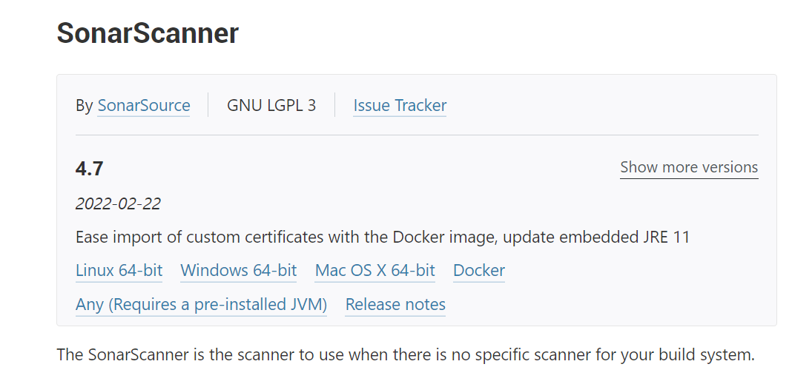
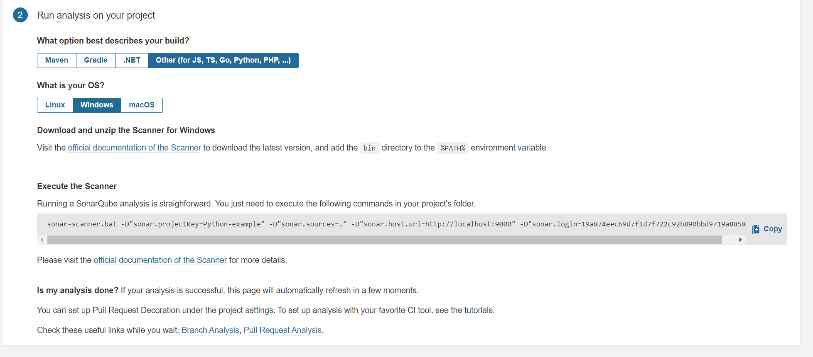
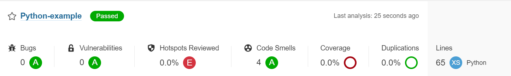
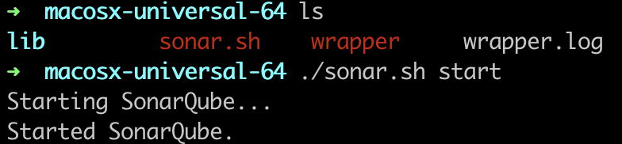
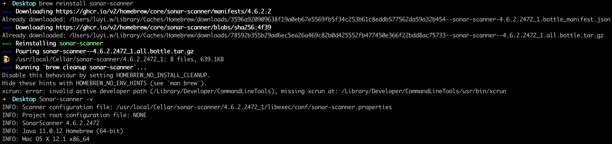
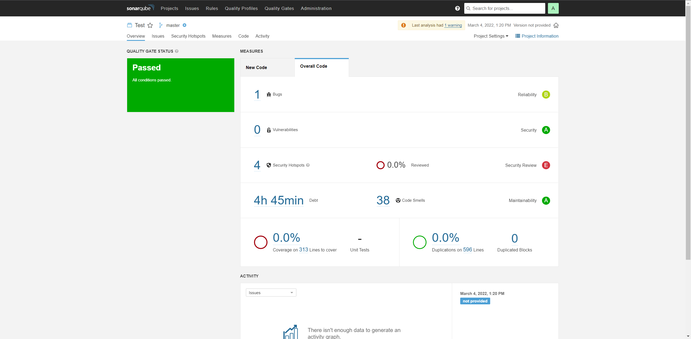

Installation and Setup
======================

Go to [SonarQube Downloads](https://www.sonarqube.org/downloads/) and downloads the free Community version

### Windows

Select your operating system folder under /bin folder, and execute "StartSonar"

Open a new broswer and go to http://localhost:9000/, type user "admin", password "admin" to login in for the first time and update your password for later usage. Then you have seen the user interface of SonarQube.

In order to scan your project, go to [SonarScanner Downloads](https://docs.sonarqube.org/latest/analysis/scan/sonarscanner/) and downloads sonar-scanner.

Open System Properties - Environment Varaibles - Path, add the location of SonarScanner's bin folder to the path.
For Example: C:\sonar-scanner-cli-4.6.2.2472-windows\sonar-scanner-4.6.2.2472-windows\bin

Open a Command Prompt, type "sonar-scanner" to verify the settings.
 
In http://localhost:9000/, create a project manually.

Input your project name.

Select "Locally" to analyze a local project.

Create a token using a specific name.

Select the option and the OS for your project. Then you will have a command you could copy to execute the scanner.

Excute the command in your project folder and then the scan result will be displayed in the user interface.

#### Mac

Start the SonarQube with ./sonar.sh start

In http://localhost:9000/, create a project manually.

Select the option and the OS for your project. Then you will have a command you could copy to execute the scanner.

.png)

Download the sonar-scanner by using the "brew install" command line, and check the version.

The scan result will be displayed in the user interface.

