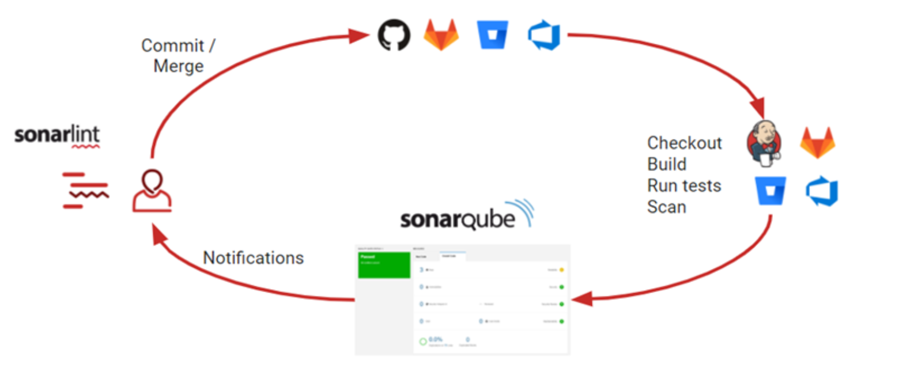
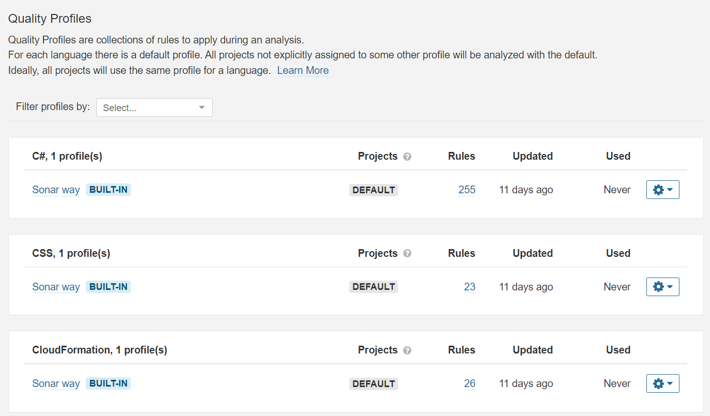
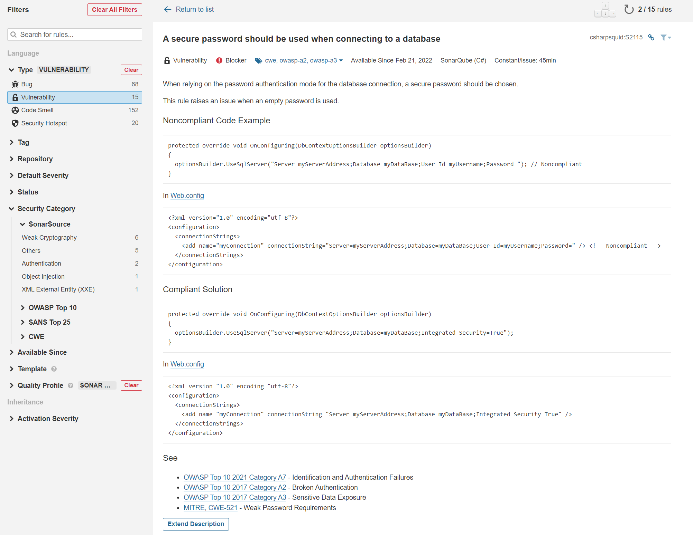
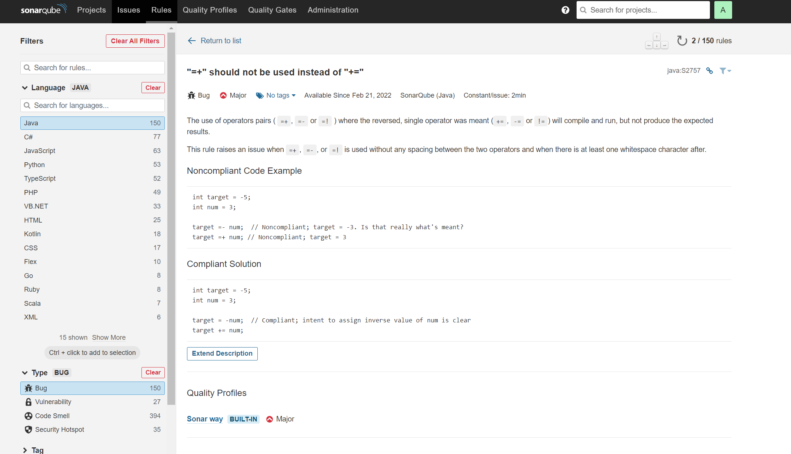
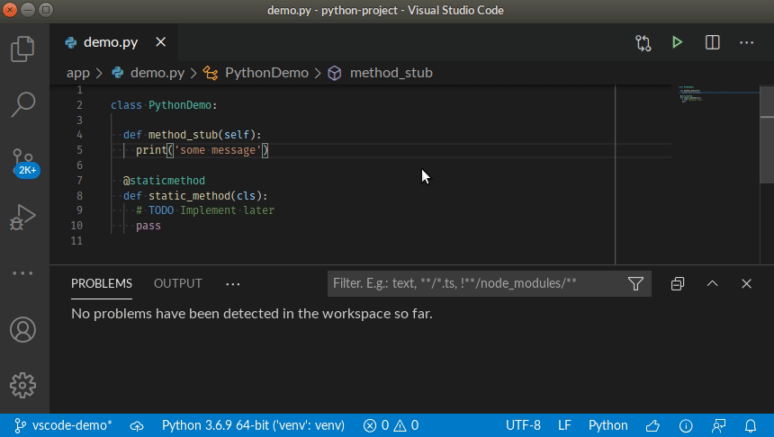

SonarQube
=========

SonarQube is an automatic code review tool to detect bugs, [code smells](https://en.wikipedia.org/wiki/Code_smell), vulnerabilities, and [security hotspot](https://docs.sonarqube.org/latest/user-guide/security-hotspots/) in your code. It can integrate with your existing workflow to enable continuous code inspection across your project branches and pull requests.

Developers could use SonarLint in their IDE to receive immeidiate feedback in the editer. 
When they check-in their code to CI tools, SonarQube scanner will analyze the code and return a result.

### How does SonarQube work

SonarQube evaluates your code against a set of rules for 27 programming languages in 4 aspects: bug, vulerability, code smell, and secutiry hotspot.

Quality Profiles are collections of rules to apply during an analysis. For each language there is a default profile. Users could create custom quality profile as well.

The rules are intoduced in the user interface. 

Take a C# vulnerability as an example, "A secure password should be used when connecting to a database".

Take a Java bug as an example, "=+" should not be used instead of "+=".

### Who uses SonarQube

SonarQube is used and loved by 300,000+ organizations.
* Barclays
* IBM
* Microsoft
* Cisco
* ...
  
### Why is SonarQube useful

* Catch tricky bugs to prevent undefined behaviour from impacting end-users.
* Fix vulnerabilities that compromise your app, and learn AppSec along the way with Security Hotspots.
* Make sure your codebase is clean and maintainable, to increase developer velocity!

### What is the real-world impact

SonarQube empowers all developers to write cleaner and safer code.

Installation and Setup
----------------------
[Instructions](./Installation.md)

Demo
-------
[Macos Demo](https://youtu.be/Rr1uH2Nvths)

[Windows Demo](https://www.youtube.com/watch?v=S4IZRTox1Cw)

IDE Extension - SonarLint
----------------------------
SonarLint is a Free and Open Source IDE extension that identifies and helps you fix quality and security issues as you code. Like a spell checker, SonarLint squiggles flaws and provides real-time feedback and clear remediation guidance to deliver clean code from the get-go.

[SonarLint for Visual Studio Code Repo](https://github.com/SonarSource/sonarlint-vscode)

Links
-----

* [Offcial Website](https://www.sonarqube.org)
* [Download](https://www.sonarqube.org/downloads/)
* [Documentation](https://docs.sonarqube.org)
* [Community](https://www.sonarqube.org/community/)
* [SonarLint Official Website](https://www.sonarlint.org/)
* [SonarCloud](www.sonarcloud.io) The online Code Quality and Security service powered by SonarSource, which offers a free 2-week trial directly online. 

Citations
---------
* https://www.sonarqube.org
* https://www.sonarlint.org
* https://github.com/SonarSource/sonarlint-vscode

