SonarQube
=========

SonarQube is an automatic code review tool to detect bugs, vulnerabilities, and [code smells](https://en.wikipedia.org/wiki/Code_smell) in your code. It can integrate with your existing workflow to enable continuous code inspection across your project branches and pull requests.

### How does SonarQube work

SonarQube evaluates your code against a set of rules for 27 programming languages in 4 aspects: bug, vulerability, code smell, and secutiry hotspot.

For example, "=+" should not be used instead of "+=" in Java. You can check rules in the 

### Who uses SonarQube

SonarQube is used and loved by 300,000+ organizations.
* Barclays
* IBM
* Microsoft
* Cisco
* ...
  
### Why is SonarQube useful

* Catch tricky bugs to prevent undefined behaviour from impacting end-users.
* Fix vulnerabilities that compromise your app, and learn AppSec along the way with Security Hotspots.
* Make sure your codebase is clean and maintainable, to increase developer velocity!

### What is the real-world impact

SonarQube empowers all developers to write cleaner and safer code.

Installation
------------

Go to [SonarQube Downloads](https://www.sonarqube.org/downloads/) and downloads the free Community version

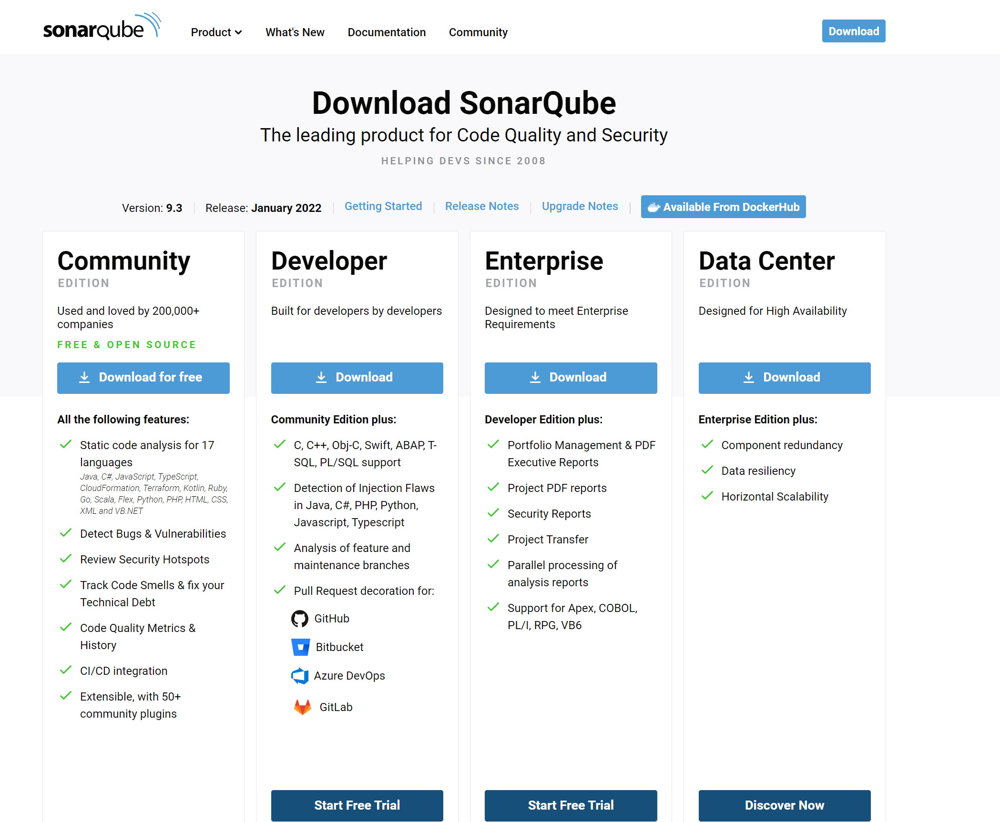

Select your operating system folder under /bin folder, and execute "StartSonar"

Open a new broswer and go to http://localhost:9000/, type user "admin", password "admin" to login in for the first time and update your password for later usage. Then you have seen the user interface of SonarQube.

In order to scan your project, go to [SonarScanner Downloads](https://docs.sonarqube.org/latest/analysis/scan/sonarscanner/) and downloads sonar-scanner.

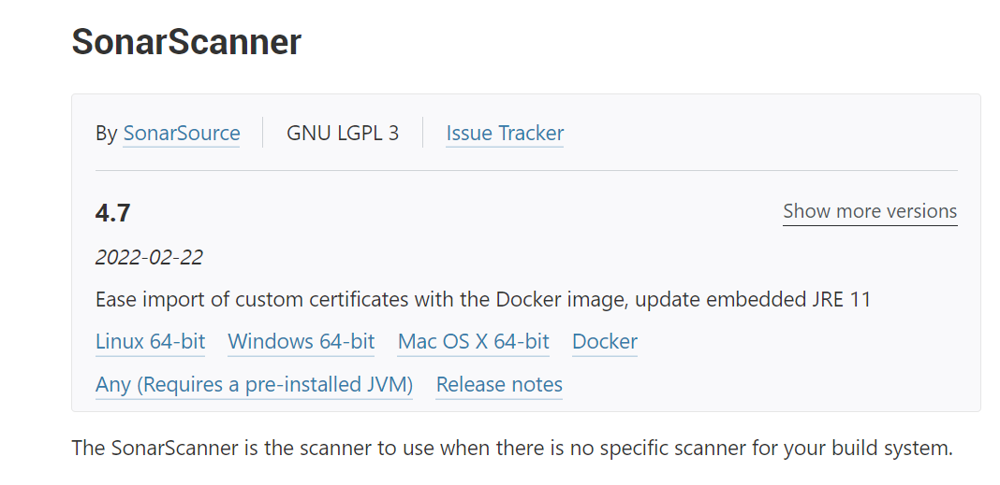

Windows

Open System Properties - Environment Varaibles - Path, add the location of SonarScanner's bin folder to the path.
For Example: C:\sonar-scanner-cli-4.6.2.2472-windows\sonar-scanner-4.6.2.2472-windows\bin

Open a Command Prompt, type "sonar-scanner" to verify the settings.
 
In http://localhost:9000/, create a project manually.

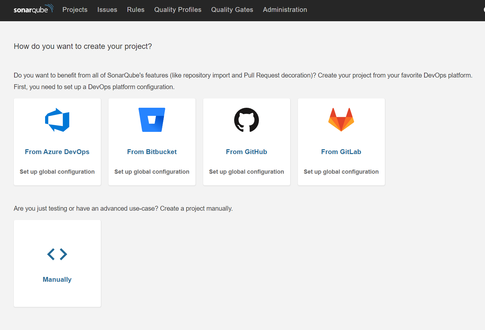

Input your project name.

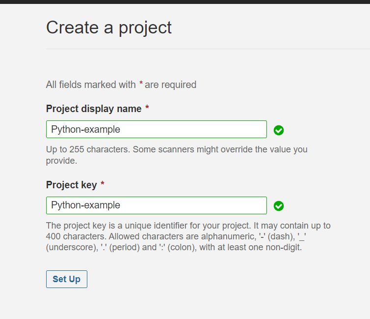

Select "Locally" to analyze a local project.

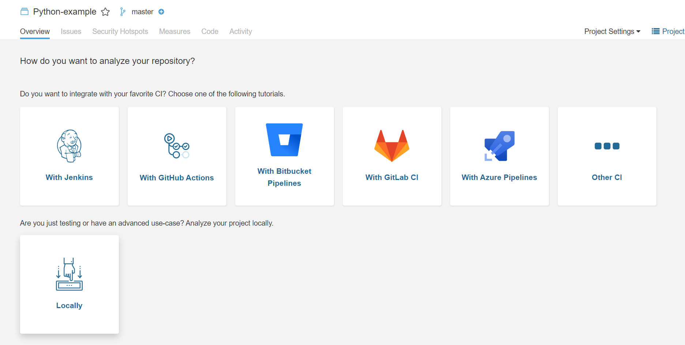

Create a token using a specific name.

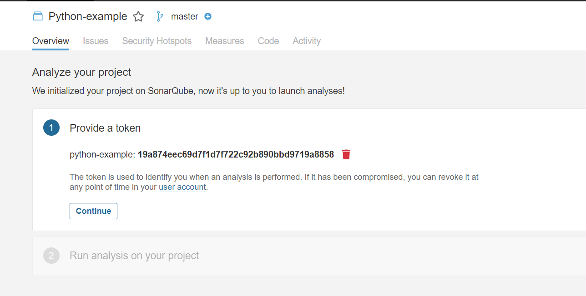

Select the option and the OS for your project. Then you will have a command you could copy to execute the scanner.

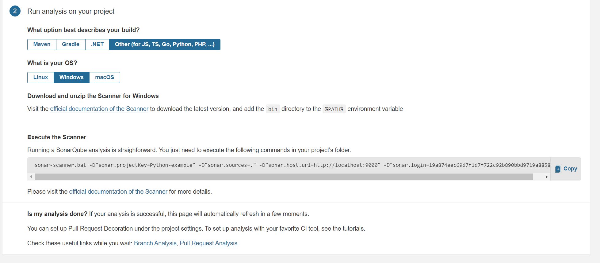

Excute the command in your project folder and then the scan result will be displayed in the user interface.

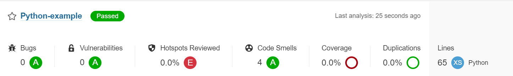

MacOS Platform

Start the SonarQube with ./sonar.sh start

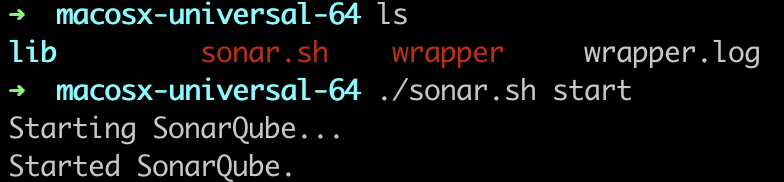

In http://localhost:9000/, create a project manually.

Select the option and the OS for your project. Then you will have a command you could copy to execute the scanner.

.png)

Download the sonar-scanner by using the "brew install" command line, and check the version.

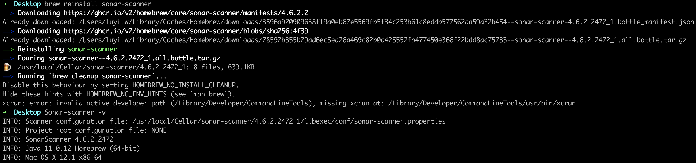

The scan result will be displayed in the user interface.

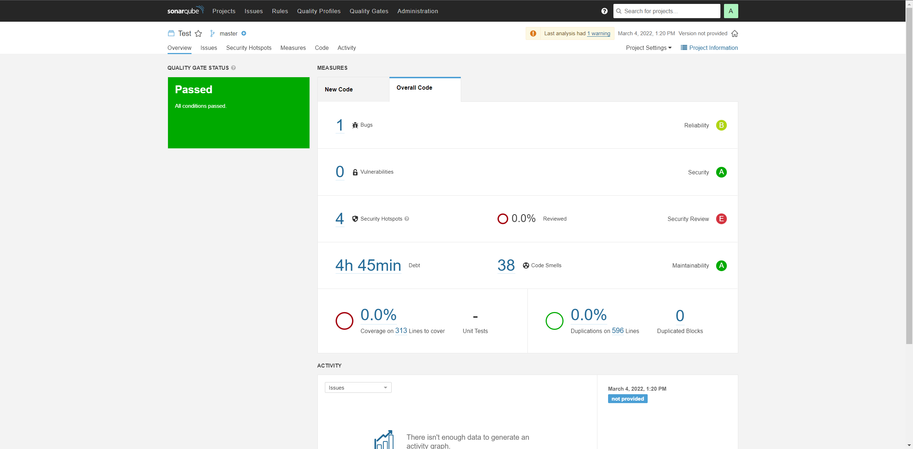

Demo
-------
Macos Demo: https://youtu.be/Rr1uH2Nvths
Windows Demo: https://www.youtube.com/watch?v=S4IZRTox1Cw

IDE Extension - SonarLint
----------------------------
SonarLint is a Free and Open Source IDE extension that identifies and helps you fix quality and security issues as you code. Like a spell checker, SonarLint squiggles flaws and provides real-time feedback and clear remediation guidance to deliver clean code from the get-go.

[SonarLint for Visual Studio Code Repo](https://github.com/SonarSource/sonarlint-vscode)

Links
-----

* [Offcial Website](https://www.sonarqube.org)
* [Download](https://www.sonarqube.org/downloads/)
* [Documentation](https://docs.sonarqube.org)
* [SonarLint Official Website](https://www.sonarlint.org/)
* [SonarCloud](www.sonarcloud.io) The online Code Quality and Security service powered by SonarSource, which offers a free 2-week trial directly online. 

Citations
---------
* https://www.sonarqube.org
* https://www.sonarlint.org
* https://github.com/SonarSource/sonarlint-vscode

